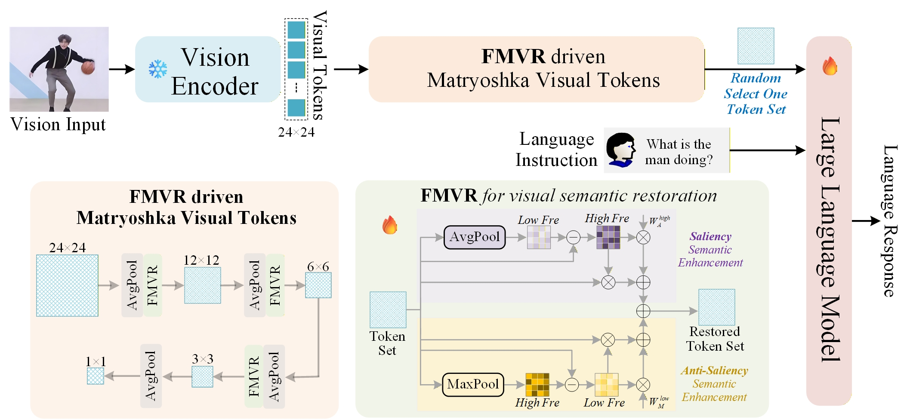

<div align="center">
  
# Frequency-Modulated Visual Restoration for Matryoshka Large Multimodal Models

[Qingtao Pan](https://qingtaopan.github.io/), [Zhihao Dou](https://scholar.google.com/citations?user=JiBGiB8AAAAJ&hl=zh-CN&oi=ao), and [Shuo Li](https://case.edu/engineering/about/faculty-and-staff-directory/shuo-li)

**CVPR Findings, 2026**

<a href='https://arxiv.org/abs/2603.11220'></a>

</div>

## Overview
FMVR disentangles the visual representation of fewer visual tokens into low- and high-frequency components through AvgPool and MaxPool. The high-frequency from AvgPool acts as a saliency filter to enhance saliency visual semantics, while the low-frequency from MaxPool acts as an anti-saliency filter to strengthen weak visual semantics. Additionally, we inject FMVR into Matryoshka Representation Learning to learn coarse-to-fine visual token sets, thus enabling to elastically adjust the number of visual tokens during inference while maintaining comparable performance.
<p align="center">
  </a> <br>
</p>

## Installation and Setup
1. Clone this repository
```bash
git clone https://github.com/QingtaoPan/FMVR.git
cd FMVR
```

2. Install Package
```bash
conda create -n FMVR python=3.10 -y
conda activate FMVR
pip install --upgrade pip  
pip install -e .
```

3. [Optional] Install additional packages for training cases
```bash
pip install -e ".[train]"
pip install flash-attn --no-build-isolation --no-cache-dir
```

## Model

Download corresponding [LLaVA](https://github.com/haotian-liu/LLaVA/blob/main/docs/MODEL_ZOO.md) checkpoints from [Hugging Face](https://huggingface.co/liuhaotian) 🤗:

| Version | LLM | Checkpoint |
|----------|:----------:|:-----------:|
| LLaVA-1.5 | Vicuna-7B | [liuhaotian/llava-v1.5-7b](https://huggingface.co/liuhaotian/llava-v1.5-7b) |
| LLaVA-1.5 | Vicuna-13B | [liuhaotian/llava-v1.5-13b](https://huggingface.co/liuhaotian/llava-v1.5-13b) |
| LLaVA-1.6 (LLaVA-NeXT) | Vicuna-7B | [liuhaotian/llava-v1.6-vicuna-7b](https://huggingface.co/liuhaotian/llava-v1.6-vicuna-7b) |
| LLaVA-1.6 (LLaVA-NeXT) | Vicuna-13B | [liuhaotian/llava-v1.6-vicuna-13b](https://huggingface.co/liuhaotian/llava-v1.6-vicuna-13b) |

## Pretraining Code
Please download the 558K subset of the LAION-CC-SBU dataset with BLIP captions we use in the paper [here](https://huggingface.co/datasets/liuhaotian/LLaVA-Pretrain).

Please refer to the documentation of llava1.5, set up the environment according to llava1.5's way, and organize the training data properly, placing it in the path ./playground. Then run the following code for inference:

```bash
bash scripts/v1_5/pretrain.sh
```

## Fine-tuning Code

Please download the annotation of the final mixture our instruction tuning data [llava_v1_5_mix665k.json](https://huggingface.co/datasets/liuhaotian/LLaVA-Instruct-150K/blob/main/llava_v1_5_mix665k.json), and download the images from constituting datasets:
- COCO: train2017
- GQA: images
- OCR-VQA: download script, we save all files as .jpg
- TextVQA: train_val_images
- VisualGenome: part1, part2

Download dataset images as in the finetuning process of llava1.5, place them in the playground, and then run the following code:
```bash
bash scripts/v1_5/finetune.sh
```

## Evaluation Code

When evaluating the model, we almost synchronously use the testing code of llava1.5, and the basic usage method is consistent. Please refer to [here](https://github.com/haotian-liu/LLaVA?tab=readme-ov-file#evaluation) for help. We provide the same script to complete the testing.

## Citation

If you find FMVR useful for your research and applications, please cite using this BibTeX:
```bibtex
@article{pan2026frequency,
  title={Frequency-Modulated Visual Restoration for Matryoshka Large Multimodal Models},
  author={Pan, Qingtao and Dou, Zhihao and Li, Shuo},
  journal={arXiv preprint arXiv:2603.11220},
  year={2026}
}
```

## Acknowledgement

We appreciate the open-source efforts of [LLaVA](https://github.com/haotian-liu/LLaVA) and [CDPruner](https://github.com/Theia-4869/CDPruner).

## License
[](https://github.com/tatsu-lab/stanford_alpaca/blob/main/LICENSE)
**Usage and License Notices**: This project utilizes certain datasets and checkpoints that are subject to their respective original licenses. Users must comply with all terms and conditions of these original licenses, including but not limited to the [OpenAI Terms of Use](https://openai.com/policies/terms-of-use) for the dataset and the specific licenses for base language models for checkpoints trained using the dataset (e.g. [Llama community license](https://ai.meta.com/llama/license/) for LLaMA-2 and Vicuna-v1.5). This project does not impose any additional constraints beyond those stipulated in the original licenses. Furthermore, users are reminded to ensure that their use of the dataset and checkpoints is in compliance with all applicable laws and regulations.
